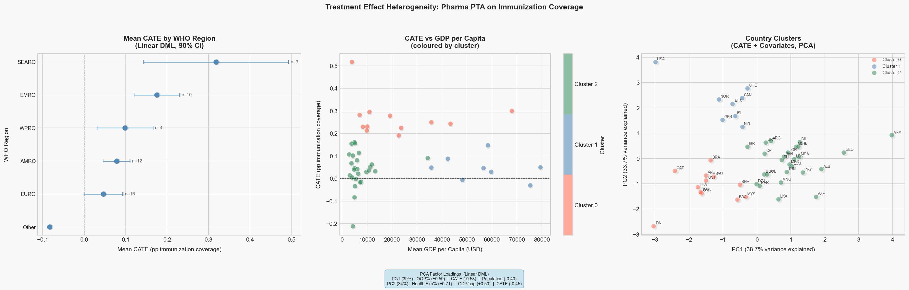
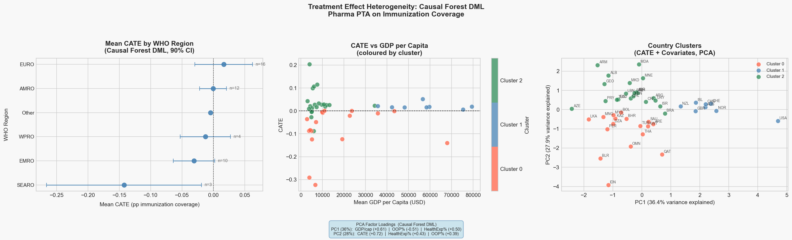
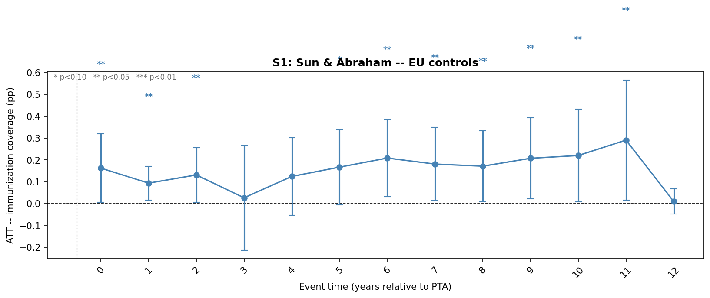
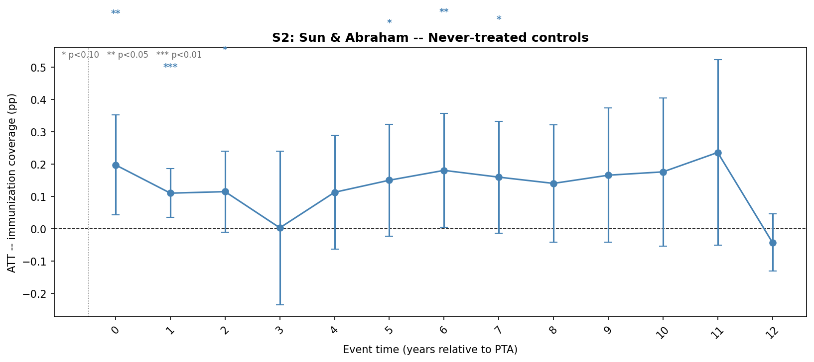

# Immunization Causal Analysis : Pharma PTAs and Immunization Coverage

## Project Overview

Causal analysis of the effect of preferential trade agreements (PTAs) on childhood
vaccine immunization coverage rates. The project examines how trade liberalization
in healthcare, specifically PTAs containing explicit health provisions, affects
vaccine uptake in non-GAVI-eligible countries. The core methodology is Double
Machine Learning (DML): Ridge regression and Logistic regression are used to partial
out country-level mediator effects from both the outcome and treatment variables,
with 3-fold cross-fitting to prevent overfitting. The resulting residuals are used
to estimate heterogeneous treatment effects (CATEs) per country, which are then
segmented via K-means clustering. Staggered DiD (Sun & Abraham, LP-DiD) is used
as a complementary identification check.

**Why This Project Matters**

This project highlights the importance of systems thinking when working with messy, real-world data and explores how economic policy decisions may indirectly influence public health outcomes. One group of stakeholders this could affect is pharmaceutical distributors, especially if tariff costs end up being absorbed within the supply chain.

---

## Research Question

Do preferential trade agreements containing health provisions causally increase
childhood vaccine immunization coverage in non-GAVI-eligible countries, and does
the effect vary systematically with country income level and health expenditure?

---

## Data Sources

| # | Data Source | Description | Local File Path |
|---|-------------|-------------|-----------------|
| 1 | WUENIC 2024 | WHO/UNICEF immunization coverage data (vaccine dose-level: BCG, DTP, MCV, PCV, ROTA, HIB, etc.) | `wuenic2024rev_web-update.xlsx` |
| 2 | WHO MI4A | Vaccine price data by product and formulation | `Data/who-mi4a-dataset-final-september-2025.xlsx` |
| 3 | Preferential Tariffs | Static preferential tariff rates across all products | `1. Preferential Tariffs.csv` / `.parquet` |
| 4 | Chemicals & Allied Industries Tariffs | HS Chapter 30 pharma-specific tariff subset (proxy for vaccine-related tariffs); used to derive country-level PTA flags | `Data/Chemicals_Allied_Industries.csv` |
| 5 | WTO-X PTA Dataset | Agreement-level dataset coding which PTAs contain health, IPR, consumer protection, and data protection provisions; used to extract health-PTA entry-into-force years per country | `Data/pta-agreements_1.xls` |
| 6 | World Bank WDI API | GDP per capita, health expenditure (% GDP), population, GNI per capita, pulled via `wbdata` (indicators: `NY.GDP.PCAP.CD`, `SH.XPD.CHEX.GD.ZS`, `SP.POP.TOTL`, `NY.GNP.PCAP.CD`) | API, cached to `wb_covariates.parquet` |
| 7 | World Bank WDI API (OOP) | Out-of-pocket health expenditure (% of current health expenditure), pulled via `wbdata` (indicator: `SH.XPD.OOPC.CH.ZS`) | API, cached to `oop_expenditure.parquet` |
| 8 | WITS/TRAINS API | Annual MFN tariff time series, pulled via `world_trade_data` | API, optional export to CSV |

---

## Data Wrangling and Merging

**1**: Load WUENIC non-EPI coverage sheets only : PCV3, ROTAC, HIB3 (vaccines most price-sensitive in middle-income markets)

**2**: Merge World Bank covariates on `country_iso3 × year` (GDP, health expenditure, population, GNI, GAVI eligibility)

**3**: Filter to non-GAVI countries (`gavi_eligible == 0`) : removes subsidised markets where the tariff → price → coverage chain is broken

**4**: Merge pharma tariff rate on `country_iso3` (static; no year dimension) and flag reporter countries

**5**: Filter to reporter countries only (`reporter_flag == 1`) : retains only countries with direct tariff observations

**6**: Merge out-of-pocket (OOP) health expenditure on `country_iso3 × year`

**7**: Construct interaction treatment: `tariff_x_oop = pharma_tariff_rate × oop_health_exp_pct / 100`

**8**: Restrict to the target year range (default 1980–2023)

---

## Feature Preparation and Feature Engineering

**Step 0** : Drops `gni_per_capita_usd` and the original `tariff_x_oop` interaction term (rebuilt below)

**Step 1 : Interaction: Tariff × Health Expenditure**
`tariff_health = pharma_tariff_rate × health_exp_pct_gdp`
Captures whether tariff impact scales with a country's overall health spending level.

**Step 2 : Interaction: Health Expenditure × OOP**
`health_exp_oop_interaction = health_exp_pct_gdp × oop_health_exp_pct`
Captures how total health spending relates to the private cost burden on individuals.

**Step 3 : Missing Value Inspection**
Checks missingness counts and percentages for `health_exp_pct_gdp` and `oop_health_exp_pct`, overall and by country.

**Step 4 : MICE Imputation**
Imputes missing values in `health_exp_pct_gdp` and `oop_health_exp_pct` using Multivariate Imputation by Chained Equations (linear regression, 10 iterations); the two variables impute each other iteratively.

**Step 5 : Categorical Encoding**
Rare countries (< 0.5% frequency) collapsed into "Other". Label-encodes `unicef_region`, `country`, `vaccine`, `antigen_family`. `reporter_flag` and `gavi_eligible` left as-is (already binary).

**Step 6 : Log-transform Outcome**
`immunization_coverage = log1p(immunization_coverage)`
Reduces right skew and compresses the coverage variable scale.

**Step 7 : Income Group Binning**
Bins `gdp_per_capita_usd` into World Bank income groups using standard thresholds:
Low < $1,135 → 0 | Lower-middle < $4,465 → 1 | Upper-middle < $13,845 → 2 | High → 3
Ordinal-encoded to preserve income ordering.

**Step 8 : Anomaly Inspection (Visual)**
Violin plots for 6 numeric variables to visually check for outliers. No removal performed.

**Step 9 : Recency Control (Years Since Vaccine Introduction)**
For each `country × antigen_family` pair, finds the first year with nonzero coverage and computes `years_since_intro = year − first_intro_year` (clipped at 0). Flags "established programs" (min coverage ≥ 50%) where true introduction pre-dates the data window, sets their `years_since_intro` to 0 and adds a binary `is_established_program` flag.

Output saved to `pivot_dataset_fe.csv`.

---

## Double Machine Learning and Country Clustering

### DML Setup

| Component | Variable | Role |
|-----------|----------|------|
| Y | `immunization_coverage` (log1p-transformed, time-detrended) | Outcome |
| T | `pta_active` (0/1) | Treatment = 1 once health PTA is in force |
| X | Country-level mean covariates (GDP, health exp, OOP, population) | CATE moderators |

**Partialling out:** Two regularized nuisance models remove the influence of country-level covariates X from both the outcome and the treatment before estimating the causal effect:

- **`model_y` (RidgeCV):** Fits E[Y | X], where ridge regularization shrinks coefficients to handle correlated covariates (GDP, OOP, health expenditure are correlated). Internal CV selects the optimal λ. Residual ε_Y captures coverage variation *not explained* by country characteristics.
- **`model_t` (LogisticRegressionCV):** Fits E[T | X] (propensity score), where L2 regularization prevents overfitting to the small treated sample. Internal CV selects C. Residual ε_T captures treatment variation *not explained* by country characteristics.

**Cross-fitting (3-fold):** Data is split into 3 folds. For each fold, nuisance models are trained on the other 2 folds and predict on the held-out fold, ensuring ε_Y and ε_T are always out-of-sample predictions, which prevents bias in the final effect estimate.

**CATE estimation:** A linear model regresses ε_Y ~ ε_T × X. The interaction slope gives each country a CATE evaluated at its mean covariate profile, with 90% confidence intervals via `effect_interval()`.

**Output:** Overall ATE + per-country CATE vector.

### Clustering

K-means (K=3) clusters countries on [CATE + GDP + health_exp + OOP + population], all standardized, producing low / medium / high treatment response groups. PCA reduces the clustering space to 2D for visualization. Input is sourced from `panel_s2` (treated + S2 never-treated controls).

---

## Causal Framework

### Staggered DiD (Identification Check)

Two scenarios are run as complementary identification checks alongside DML, each using TWFE (benchmark), Sun & Abraham (main), and LP-DiD (robustness):

- **Scenario 1 (Convergence):** Treated countries vs. EU-27 controls
- **Scenario 2 (Counterfactual):** Treated countries vs. income-matched never-treated whitelist with covariate adjustment (GDP, health expenditure)

Country-level window cleaning drops individual countries lacking ≥3 pre-treatment years rather than their entire cohort. Treatment = PTAs with explicit **Health provisions only**.

---

## Key Findings

### Treatment Effect Heterogeneity : Linear DML



**Plot 1: Mean CATE by WHO Region**

SEARO has the highest mean effect (~0.33 pp log-coverage), though CIs are wide given only 3 countries. EMRO follows at ~0.19, driven by Gulf states (Saudi Arabia, Kuwait, Qatar, Bahrain). WPRO is ~0.15, anchored by Malaysia and Thailand. AMRO and EURO are near zero, consistent with ceiling effects in already well-covered populations.

**Plot 2: CATE vs GDP per Capita**

High-CATE countries cluster in the $10k to $40k GDP range (Cluster 0, Gulf and ASEAN). Countries above $50k GDP (Cluster 1) show near-zero CATEs, consistent with saturation effects. Cluster 2 at lower GDP also shows near-zero CATEs, suggesting structural barriers absorb any PTA benefit at that income level.

**Plot 3: PCA Country Clusters**

PC1 (38.7% of variance) is an OOP vs CATE axis: higher OOP maps to lower CATE (Cluster 2, lower-middle income). PC2 (33.7%) separates by health system quality: Cluster 1 (USA, Switzerland, Canada, Norway) sits top-left with high GDP and high health expenditure; Cluster 0 (Gulf and ASEAN middle-income) sits bottom-left with moderate spending but higher CATE.

---

### Treatment Effect Heterogeneity : Causal Forest DML



The Causal Forest tells a more conservative and structurally different story than LinearDML. The overall ATE collapses to near zero (-0.009), and the regional and cluster patterns largely reverse.

**Plot 1: Mean CATE by WHO Region**

SEARO is the most negative region (~-0.14), driven almost entirely by Indonesia (-0.29), which dominates the regional mean given its size. EMRO follows at ~-0.03, with Gulf states (Oman, Qatar) pulling the average down despite Jordan and Lebanon showing small positive effects. WPRO is near zero. AMRO and EURO show small positive average CATEs. One plausible interpretation is that trade liberalization in Gulf and ASEAN markets redirects pharmaceutical investment toward more commercially attractive segments rather than routine immunization programs, particularly where public health financing is limited and private pharma interests may prioritise branded drugs or R&D activity over public immunization supply chains.

**Plot 2: CATE vs GDP per Capita**

Cluster 0 (upper-middle income, GDP ~$16.6k, Gulf and ASEAN countries) shows a neutral to negative treatment effect (~-0.08), the most striking reversal from LinearDML which had flagged this group as the highest responders. Cluster 1 (high income, GDP ~$57k, Anglosphere and EFTA) shows near-zero CATE (~+0.02), consistent with already-saturated immunization programs where PTAs add little. Cluster 2 (lower-middle income, GDP ~$8.3k, Eastern Europe, LatAm, MENA) shows the only consistently positive CATEs (~+0.03), suggesting health PTAs may provide genuine market access benefits where immunization programs still have room to grow.

**Plot 3: PCA Country Clusters**

PC1 (36.4% of variance) separates by GDP vs OOP: high-GDP, low-OOP countries sit on one side (Clusters 0 and 1) while lower-GDP, high-OOP countries sit on the other (Cluster 2). PC2 (30.8% of variance) then separates Cluster 0 from Cluster 1 by health system funding: Cluster 1 has the highest government health expenditure (~10.6%) and lowest OOP (~16%), representing well-funded public systems where PTAs change little. Cluster 0 has the lowest health expenditure share (~4.2%) and intermediate OOP (~25.8%), and shows negative CATEs. Cluster 2 carries the highest OOP burden (~39.9%) alongside moderate health expenditure (~7.6%), and is the only group where treatment effects are consistently positive, suggesting PTAs may matter most where private cost burden is high but some institutional capacity exists.

### Event Study Results (DiD Check)




Pre-treatment coefficients are statistically significant in both scenarios, indicating pre-existing divergent trends that limit causal identification via DiD alone. A positive post-treatment effect is observed across most post-treatment years, consistent with PTAs facilitating vaccine market access. LP-DiD estimates do not reach significance, likely due to the small treated sample. This motivates the DML approach as the primary estimator.

---

## Limitations

- **Parallel trends violation:** Pre-treatment significance in event studies suggests that treated and control countries were on divergent trends before PTA adoption, limiting causal identification
- **Short pre-treatment window:** Limited pre-period observations per cohort reduce the power to test and satisfy parallel trends
- **Indirect causal chain:** The PTA → vaccine tariff → price → affordability → immunization coverage pathway involves multiple intermediate steps, each subject to confounding
- **Small treatment sample:** Few countries adopted health PTAs within the panel window, limiting statistical power and the precision of CATE estimates

---

## How to Run

### Requirements

```bash
pip install pandas numpy matplotlib seaborn scikit-learn pyfixest econml \
            wbdata pycountry openpyxl world_trade_data
```

### Pipeline (run in order)

```bash
# Run all steps end-to-end
python run_all.py

# Or run steps individually:
python src/data_processing.py       # Step 1: data loading and merging
python src/feature_engineering.py   # Step 2: feature engineering
python src/run_did.py               # Step 3: staggered DiD (saves panel_s2.parquet)
python src/run_dml.py               # Step 4: LinearDML + clustering (requires Step 3)
python src/plot_heterogeneity.py    # Re-plot heterogeneity figure instantly from cache
```

Output plots are saved to `C:\Users\srima\Downloads\`. Update `OUT_DIR` in the modelling script to change the output directory.
